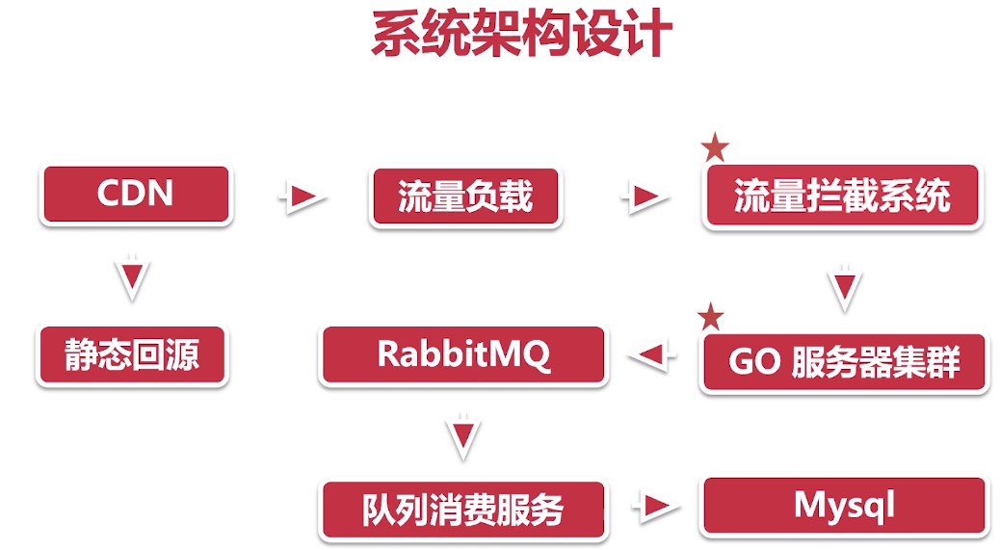

## 内容总结

###### 一、秒杀系统需求整理，主要列出秒杀系统有哪些基本功能，总结如下：
<ol>
    <li>前台商品展示；</li>
    <li>用户登录；</li>
    <li>后台订单管理；</li>
</ol>

###### 二、需求原型设计，主要通过介绍和演示墨刀工具完成需要展示的页面；
<ol>
<li>绘制前台登录页面；</li>
<li>商品展示页面；</li>
<li>抢购页面；</li>
<li>后台订单管理页面；</li>
</ol>

###### 三、系统架构：根据秒杀系统的特性，分析系统需求，设计最终架构；
###### 具体需求如下：
<ol>
<li>前端页面需要承载大流量；</li>
<li>在大并发状态下要解决超卖问题</li>
<li>后端接口需要满足横向扩展</li>
</ol>

###### 架构图总结如下：
   

###### 扩展知识
###### 推荐学习几个工具，在以后的开发工作会经常使用到，大家可以根据给出的引导连接进行学习；
###### 1.原型设计工具
<ul>
<li>

墨刀官网：<a href="https://modao.cc/">点击访问官网</a>

</li>
<li>

墨刀完整教程：<a href="https://modao.cc/tutorials/13635">点击学习详细教程</a>

</li>
</ul>

###### 2.流程图绘制工具
<ul>
<li>画图工具：<a href="https://www.draw.io">点击使用画图工具</a></li>
</ul>

###### 3.思维导图工具
<ul>
<li>百度脑图：<a href="http://naotu.baidu.com/home">点击使用脑图</a></li>
</ul>
    