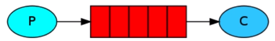
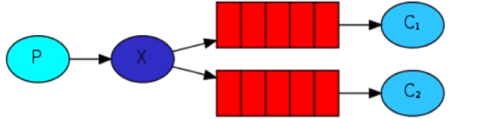

## 0，RabbitMQ依赖包安装：
    go get github.com/streadway/amqp
## 1，Simple模式
    最简单常用的模式
    1. 编写相关代码（RabbitMQ/rabbitmq.go）
    2. 先启动消费者（在web后端查看Queue是否存才）
    3. 启动生产者发送消息（观察发送者和消费者是否都成功）
    4. 在后台web UI中查看图标新
  
## 2，Work工作模式（提高新能，起到负载作用）
    1，一个消息只能被一个消费者获取
    2，启动一个生产者，多个消费者
    3，work和simple区别 -> work多一个消费者
## 3，Publish/Subscribe,订阅模式
    1，消息被路由投递个多个队列，一个消息被多个消费者获取
    2，具体代码实现：启动2个接受这，一个发送者测试
  