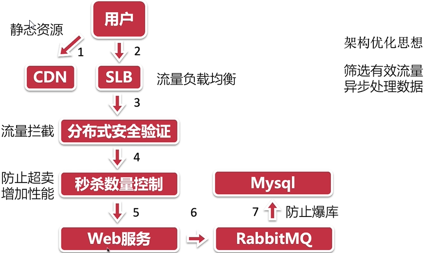
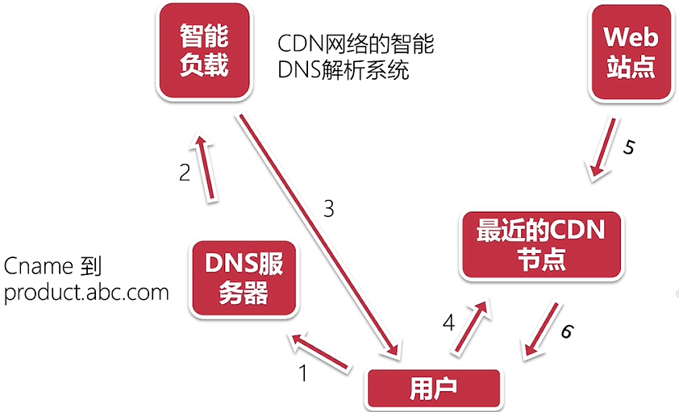
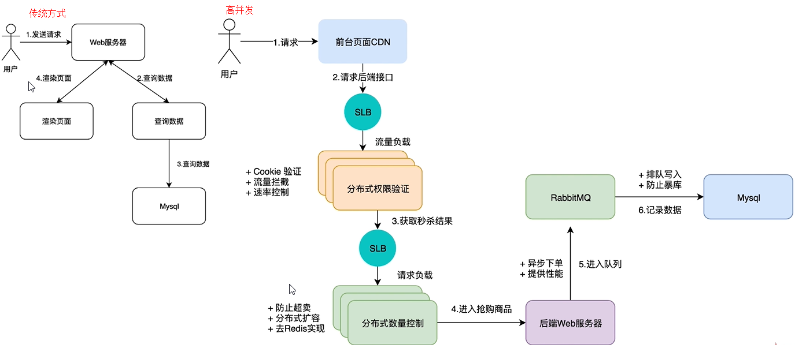

## 秒杀系统核心优化（9+）
1，整体架构分析（核心功能整体架构如下）

    用户 —> Web服务器 —> 数据库
    1，Web服务器压力大，安全验证成本高；
    2，实时读数据对数据库会造成压力；
    3，在高并发下无法保证数据一致性
2，秒杀系统架构
    
    
3，为什么需要页面静态化

    3.1，加快页面访问速度；
    3.2，减轻服务器负担；
    3.3，网站更安全不容易被攻击，比如sql注入

4，页面静态化
    
    页面静态化的几种方式
    页面静态化代码实现
    
-------------------------------------------------------

一,静态资源添加CDN
    
    1.CDN原理讲解和作用
    2.阿里云添加CDN
    3.部署前端静态文件
1.1 CDN原理
   
2.1 添加CDN

    9-10视频（阿里云CDN）
3.1 部署前端静态文件
    
    9-11视频（静态文件部署）
二，服务端优化
    
    1. 后端优化思路
    2. 突破Session限制
    3. 分布式接口实现
    4. 解决接口超卖问题
    5. RabbitMQ实现秒杀队列
1.1 优化思路
    
    1. 系统特征：高并发，大流量
    2. 优化方向：提高网站性能，保护数据库；
    3. 具体措施：静态化，分布式，消息队列；
   
   
2.1 突破Session限制

    1. Cookie替代Session集群原理
    2. 登陆代码重构
    3. 效果演示
2.2 什么是Cookie,什么是Session
    
    1. Cookie:采用的是客户端保存状态和数据的方案；
    2. Session:采用的是服务器保存状态和数据的方案；
2.3 Cookie和Session的区别
    
    1. Cookie数据是存放在客户端浏览器上，Session是保存在服务器上;
    2. Session保存在服务器上，当访问量增大，会占用大量资源;
    3. 单个Cookie保存的数据不能超过4k;
视频-登录改造1

    